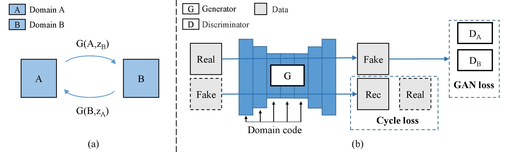
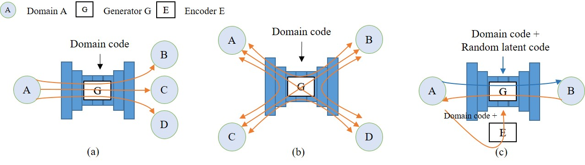
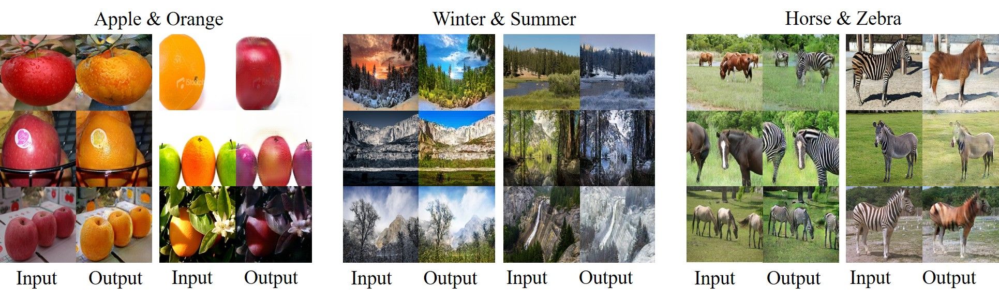
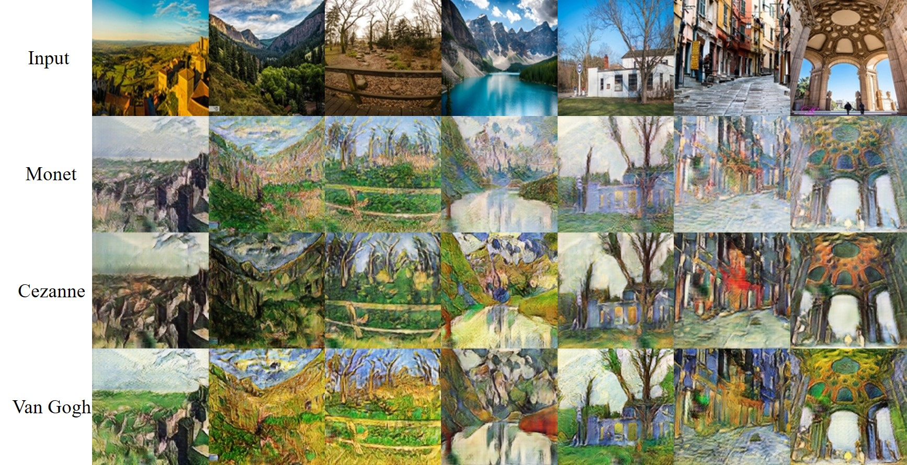
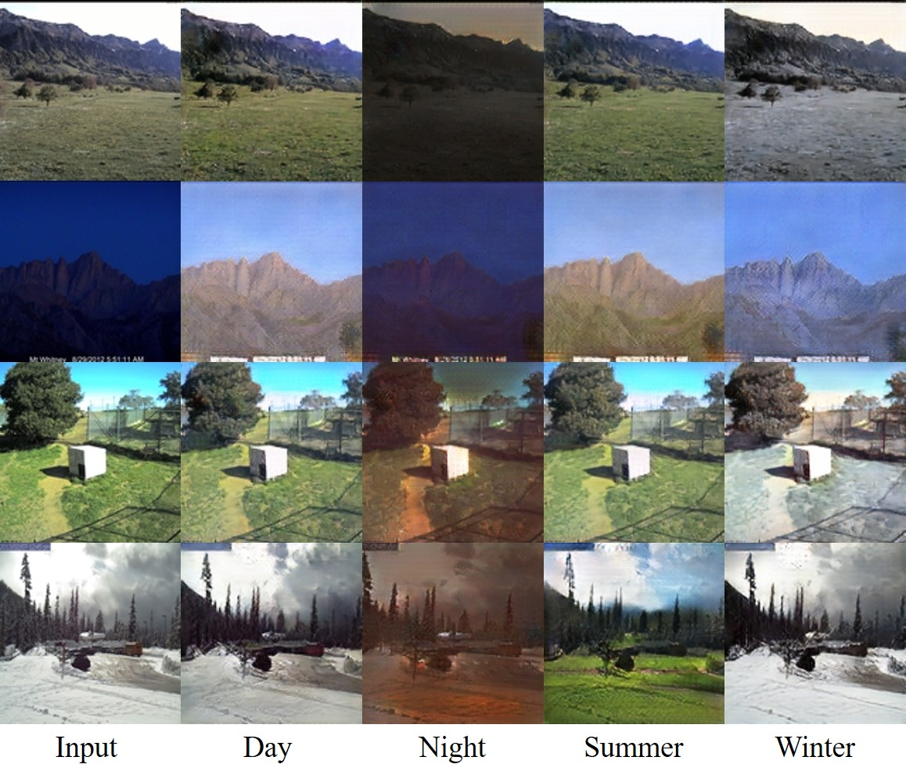
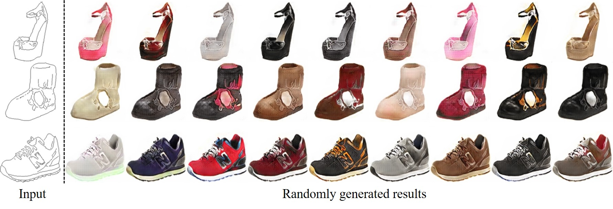

# SingleGAN

Pytorch implementation of our paper: ["SingleGAN: Image-to-Image Translation by a Single-Generator Network using Multiple Generative Adversarial Learning"](https://arxiv.org/abs/1810.04991).

By  leveraging multiple adversarial learning, our model can perform multi-domain and multi-modal image translation with a single generator.

<p align="center">

## Dependencies
 - Python 3.x
 - Pytorch 0.3 or later
 - visdom
 
## Getting Started

### Datasets
- You can either download the default  datasets (from pix2pix and CycleGAN) or unzip your own dataset  into `datasets` directory.
	* Download a default dataset (e.g.  apple2orange):
	```
		bash ./download_datasets.sh apple2orange
	```
	*  Please ensure that you have the following directory tree structure in your repository.
	```
	├── datasets
	│   └── apple2orange
	│       ├── trainA
	│       ├── testA
	│       ├── trainB
	│       ├── testB
	│        ...
	```
### Training
- Train a  base model (e.g.  apple2orange):
	```
	bash ./scripts/train_base.sh apple2orange
	```
	
- To view training results and loss plots, run python -m visdom.server and click the URL http://localhost:8097. More intermediate results can be found in `checkpoints` directory.

### Testing
- Check the folder name in `checkpoints` directory (e.g.  apple2orange).
	```
		├── checkpoints
		│   └── base_apple2orange
		│       └── 2018_10_16_14_49_55
		│           └ ...
		```
- Run
	```
	bash ./scripts/test_base.sh apple2orange 2018_10_16_14_49_55
	```
- The testing results will be save in `checkpoints/base_apple2orange/2018_10_16_14_49_55/results` directory.

**See more training and testing details for extended models  in `scripts` directory.**

### Results

#### Base model:
<p align="center">

#### One-to-many model:
<p align="center">

#### Many-to-many model:
<p align="center">

#### Multimodal model:
<p align="center">

#### bibtex
If this work is useful for your research, please cite our [paper](https://arxiv.org/abs/1810.04991):
```
@inproceedings{yu2018singlegan,    
	title={SingleGAN: Image-to-Image Translation by a Single-Generator Network using Multiple Generative Adversarial Learning},    
	author={Yu, Xiaoming and Cai, Xing and Ying, Zhenqiang and Li, Thomas and Li, Ge},    
	booktitle={Asian Conference on Computer Vision},    
	year={2018}
 }
 ```

### Contact
Feel free to reach me if there is any questions (Xiaoming-Yu@pku.edu.cn).


