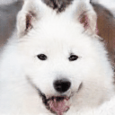
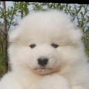
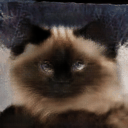
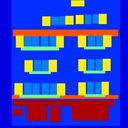
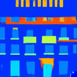
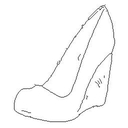
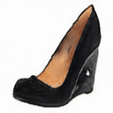
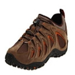
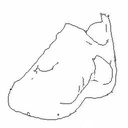

# SingleGAN

Pytorch implementation of our paper: ["SingleGAN: Image-to-Image Translation by a Single-Generator Network using Multiple Generative Adversarial Learning"](https://arxiv.org/abs/1810.04991).

By  leveraging multiple adversarial learning, our model can perform multi-domain and multi-modal image translation with a single generator.

- Base model:
<p align="center">

</p>

- Extended models:
<p align="center">

</p>


## Dependencies
 - Python 3.x
 - Pytorch 1.1.0 or later

you can install all the dependencies  by
```
pip install -r requirements.txt
```
 
## Getting Started

### Datasets
- You can either download the default  datasets (from pix2pix and CycleGAN) or unzip your own dataset  into `datasets` directory.
	* Download a default dataset (e.g.  apple2orange):
	```
	bash ./download_datasets.sh apple2orange
	```
	*  Please ensure that you have the following directory tree structure in your repository.
	```
	├── datasets
	│   └── apple2orange
	│       ├── trainA
	│       ├── testA
	│       ├── trainB
	│       ├── testB
	│        ...
	```
	*  Transient-Attributes dataset can be requested from [here](http://transattr.cs.brown.edu/).
### Training
- Train a  base model (e.g.  apple2orange):
	```
	bash ./scripts/train_base.sh apple2orange
	```
	
- To view training results and loss plots, run python -m visdom.server and click the URL http://localhost:8097. More intermediate results can be found in `checkpoints` directory.

### Testing
- Check the folder name in `checkpoints` directory (e.g.  apple2orange).
	```
	├── checkpoints
	│   └── base_apple2orange
	│       └── 2018_10_16_14_49_55
	│           └ ...
	```
- Run
	```
	bash ./scripts/test_base.sh apple2orange 2018_10_16_14_49_55
	```
- The testing results will be saved in `checkpoints/base_apple2orange/2018_10_16_14_49_55/results` directory.


**In recent experiments, we found that  [spectral normaliation](https://arxiv.org/abs/1802.05957) (SN) can help stabilize the training stage. So we add SN in this implementation. You may need to update your pytorch to 0.4.1 to support SN  or use an [old version](https://github.com/Xiaoming-Yu/SingleGAN/tree/46e339464df4de526f1f35823bbe53a42689edea) without SN.**


### Results

#### Unsupervised cross-domain translation: 
<p align="center">

#### Unsupervised one-to-many translation:
<p align="center">

#### Unsupervised many-to-many translation:
<p align="center">

#### Unsupervised multimodal translation:
Cat ↔ Dog:
<p align="center">


</p>
Label ↔ Facade:
<p align="center">


</p>
Edge ↔ Shoes:
<p align="center">


</p>


**Please note that this repository contains only the unsupervised version of  SingleGAN, you can implement the supervised version by overloading the  data loader and replacing the cycle consistency loss with reconstruction loss. See more details in our [paper](https://arxiv.org/abs/1810.04991).**

#### bibtex
If this work is useful for your research, please consider citing :
```
@inproceedings{yu2018singlegan,    
	title={SingleGAN: Image-to-Image Translation by a Single-Generator Network using Multiple Generative Adversarial Learning},    
	author={Yu, Xiaoming and Cai, Xing and Ying, Zhenqiang and Li, Thomas and Li, Ge},    
	booktitle={Asian Conference on Computer Vision},    
	year={2018}
 }
 ```

### Acknowledgement
The code used in this research is inspired by [BicycleGAN](https://github.com/junyanz/BicycleGAN).

### Contact
Feel free to reach me if there is any questions (Xiaoming-Yu@pku.edu.cn).


